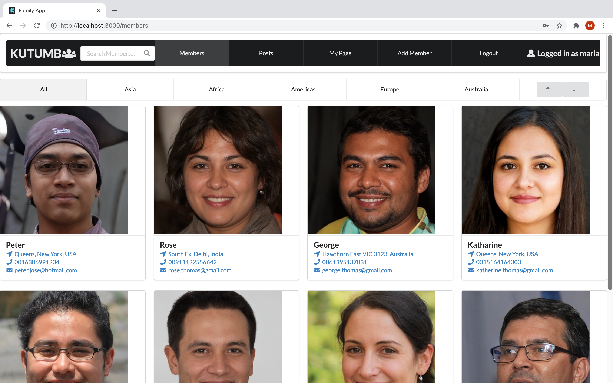

## Kutumb Frontend

This is the frontend repo of Kutumb, an app for family networking. 

### Tech Stack

* React.js
* Ruby on Rails API
* PostgreSQL DB

### Clone the repo, cd into the folder and run the following commands to start the app.

* npm install
* npm start

[Backend Repo](https://github.com/mariamoljames/kutumb-backend)